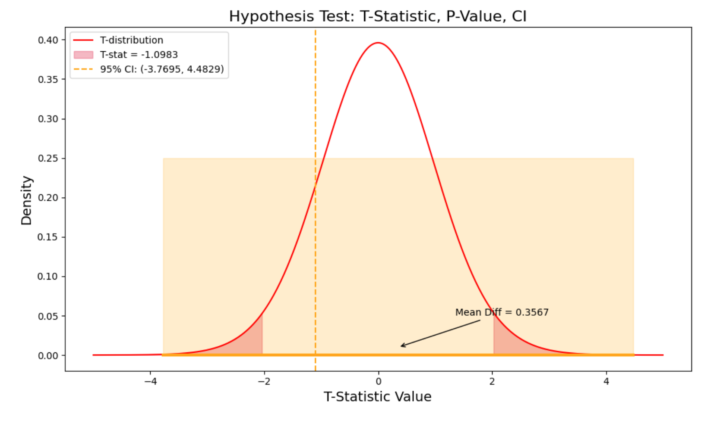

# A/B Testing - Landing Page 

 

**Description of the A/B Testing Analysis:**

A company selling a high-value service wants to determine which of two web presentations is more effective at selling. Due to the high value and infrequent nature of the sales, as well as the lengthy sales cycle, it would take too long to accumulate enough sales data to identify the superior presentation. Therefore, the company uses a proxy variable to measure effectiveness.

The dataset includes a total of 36 sessions across the two web presentations: 21 sessions for page A and 15 sessions for page B.

- **Control Group (Page A):** current view page.
  
- **Test Group (Page B):** new view page.

The dataset includes the following metrics split in two datasets:
- **Page:** The web page presentation viewed by the user.
- **Time:** The amount of time that the user spent on the web page during their session.The time is expressed in hundredths of seconds. For example, a value of 0.1 indicates 10 seconds, and a value of 2.53 indicates 253 seconds.

**Test Aims:**

The mission is to unearth the most advantageous approach for the company. Based on the following goal:

- The goal is to determine if users spend more time on page B compared to page A. If users spend more time on page B, it would suggest that page B is more effective at engaging potential customers, and therefore, does a better selling job.

- **Null Hypothesis (H₀):** There is no significant difference in the number of purchases between the control group (Page A) and the test group (Page B).
- **Alternative Hypothesis (H₁):** Moving to a new landing page version (Page B) produce an increase in the time that users spend on the new version

##   A/B TEST Landing Page Conclusion

###  Results

- P-Value:  0.2815
- Fail to reject the null hypothesis (H₀): The means are not significantly different.
- Mean Difference: 0.3567
- 95% Confidence Interval: (-3.7695, 4.4829)

###  Conclusion
Based on the results, there is no statistically significant difference in the time spent by users on the website between the control group (Page A) and the test group (Page B).

The p-value of 0.2815 exceeds the typical significance threshold of 0.05, meaning we fail to reject the null hypothesis in both cases.

Additionally, the mean difference and 95% confidence intervals for both metrics include zero, further indicating that the changes in the test group do not significantly impact user behavior compared to the control group.

As there is no meaningful difference in the time spent on Page B versus Page A, it suggests that Page B is not more effective at engaging potential customers.

